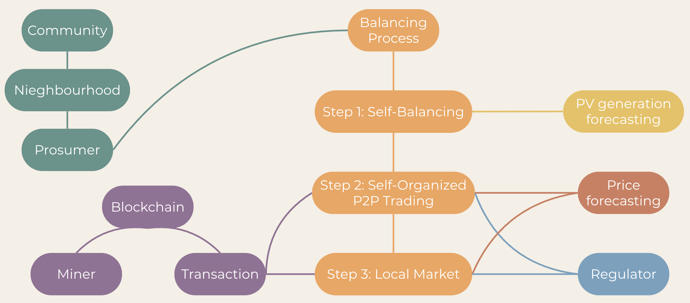

# Prosumers Community Simulator

<!-- University Logo Space -->
<div align="center">
  
  
</div>

---

## Project Information
**ICT Engineering for Smart Societies**  
**Course:** Smart Grids  
**Academic Year:** 2025/2026  


### Team Members
- Peradotto Simone - s343420
- Eléonore Amélie Charvin - s334989
- Luca Marchese - s349507
- Lorenzo Eustachio Braia - s346316
- Parnian Sarhadi - s343304

---

##  Project Overview

This project implements a complete simulation of a prosumer community in a local energy market. The simulator models the behaviour of 100 prosumers who balance their energy needs through a three-step hierarchical process, with transactions recorded on a blockchain using a Proof-of-Work consensus mechanism.

### Project Requirements (from Course Instructions)

Set up the prosumer community that has around 100 prosumers, each of whom would try to balance their energy needs through the 3 steps: 
- self-balancing
- self-organized negotiation
- local market through load aggregator.

At each time step, the prosumer needs to make decisions on:
- how much energy imbalance (after self-balance) he/she wants to trade at which price with whom (in the self-organized trading), 
-  if he/she cannot balance the imbalance, he/she needs to go to the local market with which quantity and what price.

The regulator needs to design a strategy to make the community run by pursuing some objectives, such as maximizing the entire community's profits, 
maximizing the usage of renewable energy, maximizing self-organized trading, creating maximum chaos etc. 
(not all of them, choose the most important objective you like, also you can see you can choose whatever objective you like, not necessarily a good one). 

Then you need to design strategies to push prosumers to achieve the objective you set through "regulations/rules" such as rewarding them, 
punishing them by not allowing them to trade for the next step if they do something wrong, kicking them out of the community, etc. 
(again, it does not matter how extreme your "rules" would be, as long as it works)

For each agreed transaction (bilateral trading or local markets), they must be put on the blockchain 
(thus, if you choose proof-of-work, the difficulty targets would be 3 0s as the start of the hash value of the block, e.g. 0003abef2840a.....; you can also choose proof-of-stake). 
The number of miners or validators in your system should be no less than 10.

The simulation needs to be run for at least 24 steps 
(e.g., if you imagine each trading is for one hour, then it means your simulator would simulate 24 hours; if you think each trading is for next 5 minutes, then your simulator would run for 2 2-hour time span. This would change the time scale for PV generation, price forecast, etc.).

---

##  System Architecture

### 1. Community Structure

The prosumer community is organized into **neighbourhoods** within a city environment. All the files are inside the folder `Community`.

- **Prosumers**: Each prosumer has:
  - PV generation capacity (0 to 20 panels × 0.25 kW each)
  - 24-hour load profile (realistic residential consumption pattern, modulated by a random base load of 0.5 to 1.5 kW)
  - Battery storage (0, 10, or 15 kWh capacity)
  - Neighbourhood (randomly selected)
  - Geographic location (latitude/longitude within the assigned neighbourhood)
  - Financial balance tracking
  - Transaction history

- **Neighbourhoods**: Up to 10 predefined areas in Turin, Italy:
  - Centro, San Salvario, Crocetta, Aurora, Vanchiglia, Lingotto, Santa Rita, San Donato, Cit Turin, Barriera di Milano
  - Network fees apply for cross-neighbourhood P2P trading

- **City Management**: Handles geographic distribution and visualization of prosumers across neighbourhoods

### 2. Balancing Process (Three-Step Mechanism)

`Balancing/balancingProcess.py` manages hourly energy trading through three sequential steps:

#### **Step 1: Self-Balancing**
Each prosumer:
1. Forecasts PV generation using a trained model
2. Retrieves hourly load from their consumption profile
3. Calculates residual imbalance: `imbalance = load - pv_generation`
4. Uses battery to minimize imbalance:
   - **Deficit** (imbalance > 0): Discharge battery up to available level
   - **Surplus** (imbalance < 0): Charge battery up to available capacity

#### **Step 2: Self-Organized P2P Trading**
- Prosumers are sorted by trading price:
  - **Sellers** (surplus): Cheapest first (sell at 70-90% of market price)
  - **Buyers** (deficit): Highest bid first (buy at 90-110% of market price)
- Trading occurs when buyer's bid ≥ seller's ask
- Transaction price = average of bid and ask prices
- **Bonus multipliers** applied:
  - Buyers: Cost reduced by bonus factor (e.g., 1.05 = 5% discount)
  - Sellers: Revenue increased by bonus factor (e.g., 1.05 = 5% gain)
- **Network fees**: 2% applied to cross-neighbourhood trades
- All transactions are recorded on the blockchain

#### **Step 3: Local Market (Grid/Aggregator)**
Remaining imbalances cleared with grid at fixed rates:
- **Buying from grid**: `price = market_price × (1 + aggregator_fee) × penalty_factor`
- **Selling to grid**: `price = market_price × (1 - aggregator_fee)`
- **Penalty factors** increase purchase costs for heavy grid users
- **Aggregator fees**: 5% applied to local market trades
- All transactions are recorded on the blockchain

### 3. Regulator Strategy

**Objective**: Maximize self-organized P2P trading by incentivizing local energy exchange over grid reliance.

`Balancing/regulator.py` implements a dynamic reward/penalty system:

#### **Bonus System** (Rewards for P2P Trading)
Multiplier applied to transaction prices based on cumulative P2P exchanges:
- **1+ exchanges**: 1.02× bonus (2% advantage)
- **5+ exchanges**: 1.05× bonus (5% advantage)
- **10+ exchanges**: 1.10× bonus (10% advantage)

Effect:
- Buyers pay less in P2P trades
- Sellers earn more in P2P trades
- Incentivizes continued participation in local market

#### **Penalty System** (Discourages Grid Dependency)
Multiplier applied to grid purchase prices based on cumulative grid purchases:
- **5+ grid purchases**: 1.05× penalty (5% price increase)
- **10+ grid purchases**: 1.10× penalty (10% price increase)

Effect:
- Makes grid purchases progressively more expensive
- Encourages prosumers to find P2P solutions first
- Promotes battery utilization

#### **Regulation Cycle**
After each hour:
1. Regulator audits all transactions
2. Updates each prosumer's P2P exchange and grid purchase counters
3. Recalculates bonus and penalty multipliers for next hour
4. Multipliers persist and accumulate throughout simulation

### 4. Blockchain and Consensus

`Blockchain/blockchain.py` implements the blockchain.

#### **Transaction Recording**
Every energy trade creates a `Transaction` object containing:
- Sender and receiver IDs
- Energy amount (kWh)
- Price per kWh (€/kWh)
- Timestamp and simulation step

#### **Proof-of-Work Mining**
- **Miners**: 10 independent mining nodes with random hash power (0.1-1.0)
- **Difficulty**: Blocks must start with 3 leading zeros
- **Winner Selection**: Probabilistic based on hash power (to simulate PoW competition)
- **Block Creation**: Winner packages pending transactions and mines new block
- **Validation**: SHA-256 hashing with nonce iteration until target met

#### **Blockchain Integrity**
- Each block links to previous block via hash
- Genesis block initialized at chain start
- Full chain validation performed at end of simulation

### 5. Price Forecasting

`PriceForecast/priceForecaster.py` is a Multi-output LightGBM regression model that uses historical Italian electricity market data (2021-2025) to predict:
- **PUN** (Prezzo Unico Nazionale): National wholesale price
- Hour-ahead predictions using time-series features
- Used as reference price for P2P bidding and grid transactions

### 6. PV Generation Data Download

`Data_PvProduction/fetchPvData.py` is a file aming at downloading from [PVGIS](https://re.jrc.ec.europa.eu/pvg_tools/en/) the hourly PV generation for 500 randomly generated prosumers from 2021 to 2023.

### 7. PV Generation Forecasting

`PvForecast/pvModel.py` is a XGBoost regression model that uses the historical downloaded from [PVGIS](https://re.jrc.ec.europa.eu/pvg_tools/en/) to predict the generation of 
the PV panels of each prosumer at each hour of the simulation based on their parameters.

---

## Configuration System

All simulation parameters are defined in `config.json` and can be easily modified without changing the code:

### Community Parameters
```json
"community": {
    "num_prosumers": 100,           // Total number of prosumers
    "num_neighbourhoods": 5,         // Number of active neighbourhoods
    "pv_number_range": [0, 20],      // Min/max number of PV panels per prosumer
    "pv_capacity": 0.25,             // Capacity per panel (kW)
    "battery_capacity_range": [0, 10, 15],  // Available battery sizes (kWh)
    "pv_losses": 14,                 // System losses (%)
    "neighbourhoods_pool": {...}     // Geographic boundaries for each area
}
```

### Grid Parameters
```json
"grid": {
    "network_fee": 0.02,      // Fee for cross-neighbourhood trades (2%)
    "aggregator_fee": 0.05    // Margin for grid transactions (5%)
}
```

### Regulator Policies
```json
"regulator": {
    "p2p_bonus_policy": {
        "1": 1.02,   // 2% bonus after 1 P2P exchange
        "5": 1.05,   // 5% bonus after 5 P2P exchanges
        "10": 1.10   // 10% bonus after 10 P2P exchanges
    },
    "grid_penalty_policy": {
        "5": 1.05,   // 5% penalty after 5 grid purchases
        "10": 1.10   // 10% penalty after 10 grid purchases
    }
}
```

### Blockchain Configuration
```json
"blockchain": {
    "difficulty": 3,           // Number of leading zeros required
    "number_of_miners": 10     // Mining nodes in the network
}
```

### Price Forecasting
```json
"price_forecaster": {
    "lookback_hours": 24,      // Hours of historical data for prediction
    "price_type": "PUN"        // Price metric to use
}
```

### Simulation Duration
```json
"hours": 24    // Number of hourly time steps to simulate
"date" : "2025-08-15" //Date of the simulation
```

**Note**: It is possible to experiment with different configurations by modifying the values inside `config.json` to test various scenarios.

---

##  Running the Simulation

### Prerequisites

In a terminal with Python 3.11 installed, clone this repository: 

```bash
git clone https://github.com/PerAdotz/Smart-Grids_ProsumersProject.git
```

Open a terminal and move inside the cloned folder.

Create and activate a virtual enviroment:

```bash
# Windows
py -3.11 -m venv venv
venv\Scripts\activate.bat

# macOS/Linux
python3.11 -m venv venv
source venv/bin/activate
```

Update pip:

```bash
pip install --upgrade pip
```

Install the required Python packages:

```bash
pip install -r requirements.txt
```

**Windows Note**: If you encounter errors related to long file paths, enable Windows Long Path support.

### Execution

Run the main simulation from your terminal:

```bash
cd code
python __main__.py
```

A python figure displaying the generated prosumer community will open. You need to close it for the simulation to start.

### Output Data

The following files are generated and contain the outputs of the simulation:

- **prosumer_stats.csv** contains per-prosumer, per-hour records:
  - Energy metrics: PV generation, load, battery level, imbalance
  - Financial metrics: Money balance, trading price
  - Regulatory metrics: Bonus, penalty, P2P/grid exchange counts
  - Transaction details

- **blockchain_stats.csv** contains per-hour mining records:
  - All competing miners and their hash powers
  - Winner selection
  - Number of transactions mined

### Plotting the results

Open the jupyter notebook from your terminal (inside the code folder):

```bash
jupyter notebook result_analysis.ipynb
```

Once the browser window opens, select Cell > Run All from the top menu.

Plots allowing to analyze these aspects are displayed:
- Energy Trading Dynamics (P2P vs. Grid)
- Market Pricing Analysis
- Prosumer Behavioral Metrics
- Blockchain and Mining Health

---

##  Contacts

- s343420@studenti.polito.it
- s334989@studenti.polito.it
- s349507@studenti.polito.it
- s346316@studenti.polito.it
- s343304@studenti.polito.it

---

